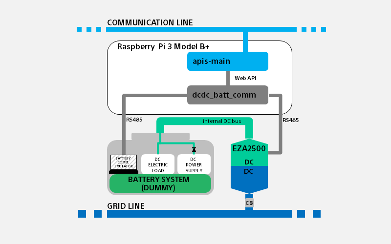

# Energy Sharing Hardware Informations

**Table of Contents**

- [Energy Sharing Hardware Informations](#energy-sharing-hardware-informations)
  - [**1. Terms and Abbreviations**](#1-terms-and-abbreviations)
  - [**2. Overview of Energy Sharing System**](#2-overview-of-energy-sharing-system)
  - [**3. Overview of Recommended Hardware Specifications**](#3-overview-of-recommended-hardware-specifications)
    - [3-1. Overview of Recommended Battery System Specifications](#3-1-overview-of-recommended-battery-system-specifications)
    - [3-2. Overview of Recommended DC/DC Converter Specifications](#3-2-overview-of-recommended-dcdc-converter-specifications)
    - [3-3. Overview of Recommended DC Grid (DC Lines) Specifications](#3-3-overview-of-recommended-dc-grid-dc-lines-specifications)
    - [3-4. Overview of Recommended Computer (Linux board) Specifications](#3-4-overview-of-recommended-computer-linux-board-specifications)
    - [3-5. Overview of Recommended Communication Line Specifications](#3-5-overview-of-recommended-communication-line-specifications)
  - [**4. Hardware Specification Requirements for apis-main Configuration**](#4-hardware-specification-requirements-for-apis-main-configuration)
    - [Values of hardware to be prepared in advance for APIS’ operational settings (not recommended hardware specifications)](#values-of-hardware-to-be-prepared-in-advance-for-apis-operational-settings-not-recommended-hardware-specifications)
  - [**5. Apis-main Configuration Items Related to Recommended Hardware Specifications**](#5-apis-main-configuration-items-related-to-recommended-hardware-specifications)
    - [5-1. Hardware Information Readout Frequency](#5-1-hardware-information-readout-frequency)
    - [5-2. Recommended Hardware Control Speed Specifications](#5-2-recommended-hardware-control-speed-specifications)
  - [**6.Sony CSL (OES Project)’s Test System**](#6sony-csl-oes-projects-test-system)
    - [6-1. Hardware system used by Sony CSL for testing during APIS development](#6-1-hardware-system-used-by-sony-csl-for-testing-during-apis-development)
      - [Composition of system](#composition-of-system)

## **1. Terms and Abbreviations**

| **Term**         | **Description**|
|:--|:--|
| apis-main        | Software for energy sharing developed by Sony CSL that enables autonomous decentralized control.|
| PP2P             | Short for Physical Peer to Peer. Distinguished from conventional P2P in that it is not a technology for facilitating electricity trading using a digital ledger management system like blockchain. Instead, it enables physical energy sharing between specific partners.|
|Unit           |Basic system component that includes a Linux board (apis-main), battery system, and DC/DC converter, forming up a node connected to the DC grid.|
|Cluster           |Multiple apis-mains existing on the communication line form a cluster and carry out energy sharings with units in the same cluster.|

---
## **2. Overview of Energy Sharing System**
* 2-1.Composition of hardware (one unit) assumed by APIS

 *In addition, the power supply and load are connected to the internal DC bus to meet the application’s requirements.

 

* [apis-main](https://github.com/SonyCSL/apis-main) carries out exchanges of hardware information through Web API([see Section 5 of the apis-main Specification Document](https://github.com/SonyCSL/apis-main)) . To enable communication with the actual battery system and DC/DC converter, in general a device driver that converts Web API data to communication and control data from hardware devices is used. The recommended specifications here therefore include the device driver in hardware specifications.

 
 

---

## **3. Overview of Recommended Hardware Specifications**
### 3-1. Overview of Recommended Battery System Specifications
The battery system supplies power for the unit’s energy sharing system. In response to a request from apis-main, the battery system’s conditions (RSoC, energy sharing permission status) are sent, and charging/discharging of the battery take places to control a energy sharing.

* Power supply
  * For the APIS energy sharing system, the power supply for controlling the DC/DC converter should be obtained from the battery system side, not the DC grid side. When stopping the output of the battery system, create a sequence that takes into account loss of the DC/DC converter control’s power supply.
    * While it depends on the system design, if the Linux board on which apis-main is installed similarly takes power from the battery system, create a sequence that takes into account loss of the Linux board (apis-main)’s power supply when stopping the output of the battery system.

* When energy sharing is permitted
  * Allow battery charging/discharging via the energy sharing control at the usual, maximum designed power rating for the energy sharing.
* When energy sharing is not permitted
  * After changing to a mode where energy sharing is not permitted, allow battery charging/discharging via the energy sharing control for the period of time (maximum 100 seconds) until apis-main’s energy sharing stop processes are completed. 
    * Even when energy sharing is not permitted, protect the battery on the battery system side.

* Communication items

    |Acquired items| |
    |:-:|:-:|
    |Relative remaining capacity (RSoC: relative state-of-charge) (%)| 	Flag for permitting/denying energy sharing (battery_operation_status)|||
   * *For details of communication commands and format (JSON format), see [Section 5 of the apis-main Specification Document](https://github.com/SonyCSL/apis-main).

 

### 3-2. Overview of Recommended DC/DC Converter Specifications
apis-main carries energy sharings by controlling the DC/DC converter connected between the battery system and the DC grid. The DC/DC converter allows bi-directional conversion between power in the connected battery system and power on the DC grid through control by apis-main.

  * Maximum rating
    * Make sure that the power/voltage/current are rated sufficiently for the connected battery system, DC grid, and their energy sharing.
    * Make sure there is appropriate insulation for the voltage and application.

  * Control power source (self-consumption)
    * Regardless of the mode, the power source for control is obtained from the battery system (do not take power for control from the DC grid side).

  * Control Mode （four modes）
    |Name|APIS Control Mode Number|Operation|Remarks|
    |:-:|:-:|:-:|:--|
    |Stop Mode|0x0000|Switching stop state|Communication is possible.|
    |CV Mode|0x0014|(Grid side) Constant Voltage Mode|Grid start-up from 0 V is possible. Voltage droop control is possible.|
    |CC Mode(Discharge)|0x0002|(Grid side) Constant Current Discharge Mode||
    |CC Mode(Charge)|0x0041|(Grid side) Constant Current Charge Mode||

  * Changing modes
    * Any mode can change directly to another mode.
    * When changing a mode, take into account the following in order: the mode, voltage settings, and current settings.
      * Reference for configuration sequence (sequence of 1-2-3; the same number indicates no particular order for that number)
      * (Below is for reference purposes. In an actual system, set and evaluate to ensure that the procedures are appropriate for the operations.)
 
      |Mode after changing→ ↓Mode before changing|Stop Mode Ex:dvg=350V,dig=0A|CC Mode(discharge) Ex:dvg=380V,dig=2A|CC Mode(charge) Ex:dvg=350V,dig=2A|CV Mode Ex:dvg=350V,dig=7.5A)|
      |:--|:--|:--|:--|:--|
      |Stop Mode Ex:dvg=350V,dig=0A|1. Set dvg 1. Set dig 2. Set Mode|1. Set dvg 1. Set dig 2. Set Mode|1. dvg 設定 1. dig 設定 2. Mode 設定|1. Set dvg 1. Set dig 2. Set Mode|
      |CC Mode(discharge) Ex:dvg=380V,dig=2A|1. Set Mode 2. Set dvg 2. Set dig|Change not executed by APIS|Change not executed by APIS|1. Set dvg 2. Set Mode 3. Set dig|
      |CC Mode(charge) Ex:dvg=350V,dig=2A|1. Set Mode 2. Set dvg 2. Set dig|Change not executed by APIS|Change not executed by APIS|1. Set dvg 2. Set Mode 3. Set dig|
      |CV Mode dvg=350V,dig=7.5A)|1. Set Mode 2. Set dvg 2. Set dig|Change not executed by APIS|Change not executed by APIS|Change not executed by APIS|

    * Return values when setting mode control are returned after changing to the mode.

  * Communication items
    * Acquired items _* indicates that non-mandatory items._
      |dcdc_status| | | | |
      |:-:|:-:|:--:|:--:|:--:|
      |Status number (status) |Alarm number (alarm) |Alarm information (alarmState) |_DCDC running state (runningState)*_|Operation mode (operationMode)|

      |meter| | | |
      |:-:|:-:|:-:|:-:|
      |Grid|Power (wg)|Voltage (vg)|Current (ig)|
      |Battery|Power (wb)|Voltage (vb)|Current (ib)|
      |Other|DCDC Temperature (tmp)|||

      |vdis||
      |:-:|:-:|
      |DC Grid Target Voltage(dvg)|DC Grid Droop Rate (drg)|

      |param:initial settings (partial)|　|　|　|
      |:-:|:-:|:-:|:-:|
      |Grid|Upper-Limit Current (dig)|_Excess Voltage Threshold (ogv)*_|_Low Voltage Threshold (ugv)*_|　|
      |Battery|_Upper-Limit Current  (cib)*_|_Excess Voltage Threshold (obv)*_|_Low Voltage Threshold (ubv)*_|

    * Control items
        |mode|dvg|dig|drg|
        |:-:|:-:|:-:|:-:|
        |Control Mode Number|DC Grid Target Voltage|DC Grid Upper-Limit Current|DC Grid Droop Rate|
      * Example of control command
        * `/dcdc/set?mode=<Mode>&dvg=<C Grid Target Voltage>&dig=<DC Grid Upper-Limit Current>&drg=<DC Grid Droop Rate>`
        * *For details of communication commands and format (JSON format), see [Section 5 of apis-main Specification Document](https://github.com/SonyCSL/apis-main).

 

### 3-3. Overview of Recommended DC Grid (DC Lines) Specifications

* The recommended specifications for DC wiring vary depending on the operating environment and location, voltage used, etc., as well as on regulations and compliance standards.
  * Design the energy sharing system appropriately in line with its implementation environment and location, voltage to be used, etc. Take into account the number of energy sharing pairs, maximum energy sharing rating, and grid topology. Prepare safety measures such as insulation and maintenance functions to protect against overcurrent, overvoltage, short circuits, leakages, ground fault, lightning, etc.
    * In particular, design the system by taking into account the DC grid’s current capacity. Consider the energy sharing’s maximum current per unit and the number of maximum energy sharing pairs. Also, examine the grid topology and find points where currents concentrate.

### 3-4. Overview of Recommended Computer (Linux board) Specifications
  * See [Section 16 of the apis-main Specification Document](https://github.com/SonyCSL/apis-main).

 

### 3-5. Overview of Recommended Communication Line Specifications
* Implement the network so that apis-mains that make up the same cluster are connected on the same network.
  * Ethernet (20Mbps/1 port or more, support for IPv4 and IPv6)

 
 

---

## **4. Hardware Specification Requirements for apis-main Configuration**
### Values of hardware to be prepared in advance for APIS’ operational settings (not recommended hardware specifications)

* Hardware specifications (values) required for configuring hwConfig.json
  * Set the appropriate values based on the specifications of the battery system and DC/DC converter that make up a unit.
    * See [Section 6.2 of the apis-main Specification Document](https://github.com/SonyCSL/apis-main).
* Hardware specifications (values) required for configuring Policy.json
  * Set the appropriate values based on the specifications of the grid (DC lines) to be implemented.
    * See [Section 6.4 of the apis-main Specification Document](https://github.com/SonyCSL/apis-main).

 
 

---

## **5. Apis-main Configuration Items Related to Recommended Hardware Specifications**
### 5-1. Hardware Information Readout Frequency
* apis-main carries out control of energy sharing by periodically reading its own unit’s hardware information.
  * Because the timing of confirming the unit’s conditions and generating energy sharing deals depend on this readout frequency, adjust it along with the hardware response speed to meet the requirements of the energy sharing system.
* How to configure: Set the following item in the apis-main’s Policy.json file.
  * controller.dataAcquisitionPeriodMsec

 

### 5-2. Recommended Hardware Control Speed Specifications
  * The speed of energy sharing control has an effect on power loss due to the control.
    * The greater the ratio between the control time (time from instruction by apis-main until actual operation) and the energy sharing time, the greater the percentage of power loss (due to control) for one energy sharing.
  * Taking into consideration assumptions about power loss  by the energy sharing system being used, set the energy sharing time and the control speed of the DC/DC converter.
    * Minimum energy sharing time: Determined by the setting in apis-main’s Policy.json file.
      * oprationGridVoltageV: Operating voltage (V) of DC grid
      * mediator.deal.gridCurrentA:  Current (A) of one energy sharing
      * mediator.deal.amountMinWh: Minimum power (Wh) of one energy sharing
  * Control speeds of hardware
    * Device Driver’s processing time, DC/DC converter’s response speed, and the number of retries
    * Communication speed between Device Driver and hardware, etc.

 
 

---

## **6.Sony CSL (OES Project)’s Test System**

### 6-1. Hardware system used by Sony CSL for testing during APIS development
#### Composition of system

* Battery System: Simulates the operations of a battery system
  * DC regulated power supply (4kW rating) + DC electronic load (4kW rating)
    * Allows current on the battery side flowing to the DC/DC converter via energy sharing control and simulates charging/discharging of the battery system. (A four-quadrant power supply is acceptable.)
    * Communication: PC-based emulator (RS485)
      * [Example of RS485-based communication specifications](/rs485-battery-comm_EN.md)
* DC/DC converter: TDK-Lambda EZA-2500-32048SC0
  * Customized model in EZA2500 series for running APIS
     |Specification item|Content of customization|Remarks|
     |:-:|:-:|:--|
     |Control mode|Added|Heteronomous charging CC mode Heteronomous discharging CC mode Heteronomous charging CV mode (Grid CC)|
     |HVDC 0V startup|Possible|Startup mode without HVDC applied voltage limit.|
     |HVDC-side auxiliary power supply (Internal control power supply)|Removed||

    * For inquiries about specification details and how to obtain the equipment, please contact the seller (TDK-Lambda).
* Computer (Linux board)
  * Raspberry Pi 3 Model B+
    * [dcdc_batt_comm](https://github.com/SonyCSL/apis-dcdc_batt_comm) installed for the device driver.
    * To connect to the battery system and DC/DC converter, USB-to-RS485 converter adapters are used. 

 
 

