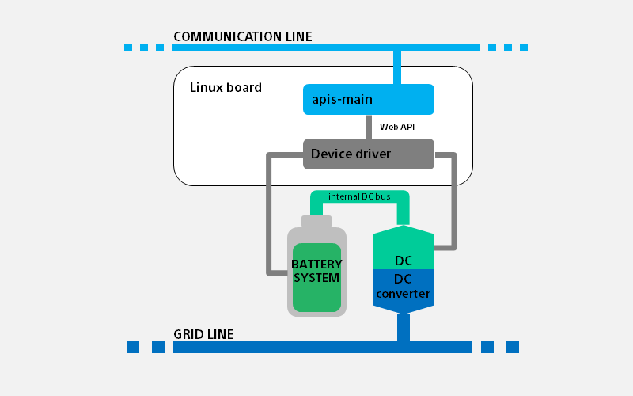
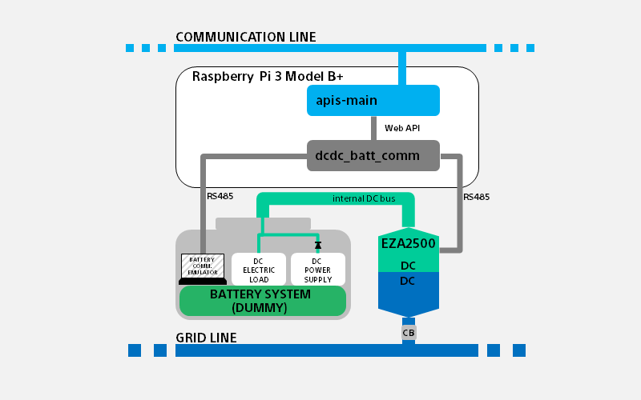

# 電力相互融通 ハードウェア情報

**目次**
- [電力相互融通 ハードウェア情報](#電力相互融通-ハードウェア情報)
  - [**1. 用語・略語**](#1-用語略語)
  - [**2. 電力相互融通システム概要**](#2-電力相互融通システム概要)
  - [**3. ハードウェア要求概要**](#3-ハードウェア要求概要)
    - [3-1. 蓄電システム要求概要](#3-1-蓄電システム要求概要)
    - [3-2. DC/DC converter 要求概要](#3-2-dcdc-converter-要求概要)
    - [3-3. DCグリッド(DC配線)要求概要](#3-3-dcグリッドdc配線要求概要)
    - [3-4. コンピュータ(Linux-board)要求概要](#3-4-コンピュータlinux-board要求概要)
    - [3-5. コミュニケーションライン要求概要](#3-5-コミュニケーションライン要求概要)
  - [**4. apis-main設定に必要なハードウェア仕様**](#4-apis-main設定に必要なハードウェア仕様)
    - [ハードウェア要求ではないが、APIS動作設定の為に事前に準備が必要なハードウェアの値](#ハードウェア要求ではないがapis動作設定の為に事前に準備が必要なハードウェアの値)
  - [**5. ハードウェア要求に関わるapis-mainの設定項目**](#5-ハードウェア要求に関わるapis-mainの設定項目)
    - [5-1. ハードウェア情報の読出頻度](#5-1-ハードウェア情報の読出頻度)
    - [5-2. ハードウェアへの制御速度への要求](#5-2-ハードウェアへの制御速度への要求)
  - [**6.Sony CSL（OESプロジェクト)における実験例の紹介**](#6sony-csloesプロジェクトにおける実験例の紹介)
    - [6-1. Sony CSL が APIS 開発時に実験システムとして利用したハードウェア構成](#6-1-sony-csl-が-apis-開発時に実験システムとして利用したハードウェア構成)
      - [システム構成](#システム構成)

## **1. 用語・略語**

| **用語**         | **説明**|
|:--|:--|
| apis-main        | Sony CSL が開発した電力相互融通ソフトウェアの名称である|
| PP2P             | Physical Peer to Peer の略である ブロックチェーン等による台帳管理による電力取引ではなく 物理的に特定の相手間での電力交換ができるという意味を込めてP2Pと分けた表現にしている|
|ユニット           |DCグリッド上に接続された１つのノードが構成する  Linux-board(apis-main)、蓄電システム、DC/DC converter を含めたシステムの単位|
|クラスタ           |apis-mainは、コミュニケーションライン上に存在する複数のapis-mainとクラスタを構築し、 同一クラスタのユニットと電力相互融通を実施する|

---
## **2. 電力相互融通システム概要**
* 2-1.APISが想定するシステムハードウェア(1ユニット)構成

 ※この他に、アプリケーションに合わせて、internal DC bus には、電源や負荷が接続される。

 

* [apis-main](https://github.com/SonyCSL/apis-main) は、Web API([apis-main仕様書 5項参照](https://github.com/SonyCSL/apis-main)) にてハードウェア情報のやり取りを行い、情報の取得や制御を実施する。実際の蓄電システムや DC/DC converter と通信させるには、様々なハードウェアデバイスを使用可能にするために、Web API を各々のハードウェアデバイスの通信・制御方式へと変換する Device Driver を用意する構成が一般的である。従って、本要求は、Device Driver を含めたハードウェアに対する要求である。

 
 

---

## **3. ハードウェア要求概要**
### 3-1. 蓄電システム要求概要
自ユニットの融通システムの電源を供給し、apis-main のリクエストに応じて、自身の状態(RSOC, 融通許可/不許可)情報を送信し、電力相互融通制御によって発生するバッテリの充放電を許容する蓄電システムであること。

* 電源供給
  * APISによる電力相互融通システムでは、DC/DC converter の制御電源は、DCグリッド側ではなく蓄電システム側から取得する事を要求する。蓄電システムの出力を停止する場合には、DC/DC converter の制御電源喪失に配慮したシーケンスにすること。
    * システムの設計次第ではあるが、apis-main がインストールされた、Linux-board も同様に蓄電システムから取得する場合には、同様に、蓄電システムの出力を停止する場合の Linux-board(apis-main) の電源喪失にも配慮したシーケンスにすること。

* 融通許可時
  * 常時、設計された最大融通電力定格での融通制御によるバッテリ充放電を許容すること。
* 融通不許可時
  * 融通不許可状態遷移後、apis-main の融通停止処理が完了するまでの間(最大100sec)は、融通制御によるバッテリの充放電が継続される事を許容する事。
    * 許容できない場合においては、蓄電システム側でバッテリを保護すること。

* 通信項目

    |取得項目| |
    |:-:|:-:|
    |相対残容量[%] (rsoc)|電力融通許可/不許可フラグ (battery_operation_status)|||
   * ※通信コマンドと通信フォーマット(JSON形式)の詳細は、[apis-main仕様書 5項参照](https://github.com/SonyCSL/apis-main)。

 

### 3-2. DC/DC converter 要求概要
apis-main は、蓄電システムとDCグリッドの間に接続された DC/DC converter を制御することにより、蓄電システム間の電力相互融通を実現する。apis-main の制御により、接続された蓄電システムの電力を、DCグリッドの電力へ双方向に変換可能な DC/DC converter であること。

  * 最大定格
    * 接続された蓄電システムとDCグリッド、及びその電力相互融通において、十分な 電力/電圧/電流 定格であること。
    * 電圧・用途に応じて適切に絶縁処理がされていること。

  * 制御電源(自己消費)
    * モードに関わらず制御電源は蓄電システムから得る事(DCグリッド側から制御電源をとらないようにすること)。

  * 制御 Mode（4モード）

    |名称|APIS制御 Mode番号|動作|備考|
    |:-:|:-:|:-:|:--|
    |停止 Mode|0x0000|スイッチング停止状態|通信は可能|
    |CV Mode|0x0014|(グリッド側)定電圧モード|グリッド0Vからの起動ができること 電圧Droop制御ができること|
    |CC Mode(放電)|0x0002|(グリッド側)定電流放電モード||
    |CC Mode(充電)|0x0041|(グリッド側)定電流充電モード||

  * Mode 遷移
    * いずれのモードであっても、任意のモードへ直接遷移ができること。
    * モード遷移の際には、モード・電圧・電流設定順序に配慮すること。
      * 設定順序参考(1,2,3の順：同じ数字の場合は順不同)
        * (以下は参考であり、実際のシステムにおいては、動作に合わせて適切な手順になるよう設計・評価すること)
  
      |遷移後のMode→ ↓遷移前のMode|停止 Mode 例:dvg=350V,dig=0A|CC Mode(放電) 例:dvg=380V,dig=2A|CC Mode(充電) 例:dvg=350V,dig=2A|CV Mode 例:dvg=350V,dig=7.5A|
      |:--|:--|:--|:--|:--|
      |停止 Mode 例:dvg=350V,dig=0A|1. dvg 設定 1. dig 設定 2. Mode 設定|1. dvg 設定 1. dig 設定 2. Mode 設定|1. dvg 設定 1. dig 設定 2. Mode 設定|1. dvg 設定 1. dig 設定 2. Mode 設定|
      |CC Mode(放電) 例:dvg=380V,dig=2A|1. Mode 設定 2. dvg 設定 2. dig 設定|APISでは 実行しない遷移|APISでは 実行しない遷移|1. dvg 設定 2. Mode 設定 3. dig 設定|
      |CC Mode(充電) 例:dvg=350V,dig=2A|1. Mode 設定 2. dvg 設定 2. dig 設定|APISでは 実行しない遷移|APISでは 実行しない遷移|1. dvg 設定 2. Mode 設定 3. dig 設定|
      |CV Mode 例:dvg=350V,dig=7.5A|1. Mode 設定 2. dvg 設定 2. dig 設定|APISでは 実行しない遷移|APISでは 実行しない遷移|APISでは 実行しない遷移|

    * Mode 制御指示(set)時の戻り値は、モード遷移後の値を返すこと

  * 通信項目
    * 取得項目 _*印は必須ではない_
      |dcdc_status| | | | |
      |:-:|:-:|:--:|:--:|:--:|
      |ステータス状態番号(status) |アラーム番号(alarm) |アラーム情報(alarmState) |_DCDC動作状態(runningState)*_|動作モード(operationMode)|

      |meter| | | |
      |:-:|:-:|:-:|:-:|
      |グリッド|電力値(wg)|電圧値(vg)|電流値(ig)|
      |バッテリ|電力値(wb)|電圧値(vb)|電流値(ib)|
      |その他|DCDC温度(tmp)|||

      |vdis||
      |:-:|:-:|
      |DC Grid 目標電圧値(dvg)|DC Grid Droop 率(drg)|

      |param：初期設定(の一部)|　|　|　|
      |:-:|:-:|:-:|:-:|
      |グリッド|上限電流値(dig)|_過電圧閾値(ogv)*_|_低電圧閾値(ugv)*_|　|
      |バッテリ|_上限電流値(cib)*_|_過電圧閾値(obv)*_|_低電圧閾値(ubv)*_|

    * 制御項目
        |mode|dvg|dig|drg|
        |:-:|:-:|:-:|:-:|
        |制御 Mode番号|DC Grid 目標電圧値|DC Grid 上限電流値|Grid Droop 率|
      * 制御コマンド例
        * `/dcdc/set?mode=<Mode>&dvg=<DC Grid 電圧値>&dig=<DC Grid 電流値>&drg=<DC Grid Droop 率>`
        *  ※通信コマンドと通信フォーマット(JSON形式)の詳細は、[apis-main仕様書 5項参照](https://github.com/SonyCSL/apis-main)

 

### 3-3. DCグリッド(DC配線)要求概要

* DCによる電力配線は、使用環境や場所、使用電圧などによって、法規制や適合規格など要求が異なる。
  * 融通システムが実装される環境や場所、使用電圧に合わせて適切に設計し、融通ペア数・融通最大定格・グリッド配線トポロジーなどに配慮し、過電流・過電圧・短絡・漏電・地絡・落雷・絶縁の保護措置など、安全保護やメンテナンス機能を備えるようにする事。
     * 特にDCグリッドの電流容量に関しては、１ユニットあたりの融通の最大電流と最大融通ペア数、グリッドの配線トポロジーから、電流が集中するポイントに配慮し設計すること。

### 3-4. コンピュータ(Linux-board)要求概要
  * [apis-main仕様書 16項参照](https://github.com/SonyCSL/apis-main)

 

### 3-5. コミュニケーションライン要求概要
* 同一クラスタとなる apis-main は、同一のネットワークに接続されるようにネットワークを構成すること。
  * Ethernet(20Mbps/1ポート以上, IPv4 IPv6 サポート)

 
 

---

## **4. apis-main設定に必要なハードウェア仕様**
### ハードウェア要求ではないが、APIS動作設定の為に事前に準備が必要なハードウェアの値

* hwConfig.json の設定に必要なハードウェア仕様(数値)
  * ユニットを構成する蓄電システムや DC/DC converter の仕様に合わせて、適切に数値を設定する。
    * [apis-main仕様書 6.2項参照](https://github.com/SonyCSL/apis-main)

* Policy.json の設定に必要なハードウェア仕様(数値)
  * 構築するグリッド(DC配線)の仕様に合わせて、適切に数値を設定する。
    * [apis-main仕様書 6.4項参照](https://github.com/SonyCSL/apis-main)

 
 

---

## **5. ハードウェア要求に関わるapis-mainの設定項目**
### 5-1. ハードウェア情報の読出頻度
* apis-main は、定期的に自ユニットのハードウェア情報を読み出して融通制御実施する。
  * この読み出し頻度によって、自ユニット状態確認や融通の Deal 生成などのタイミングが変化するので、ハードウェアの応答速度と、融通システムに合わせて調整すること。
* 設定方法：apis-main の設定ファイル Policy.json 内の以下の項目にて設定する。
  * controller.dataAcquisitionPeriodMsec

 

### 5-2. ハードウェアへの制御速度への要求
  * 融通制御の速度は、制御による電力損失に影響する
    * 融通時間に対して、apis-main の制御指示から、DC/DC converter が実際に動作するまでの制御時間の割合が大きい程、1つの融通に対する制御による電力損失の割合が大きくなる。
  * 利用する融通システムの損失想定に考慮し、融通時間と DC/DC converter の制御速度を設計すること。
    * 最小融通時間：apis-main の Policy.json の設定によって決まる
        * oprationGridVoltageV：DC Grid 動作電圧 (V)
        * mediator.deal.gridCurrentA	1電力融通の電流 (A)
        * mediator.deal.amountMinWh：1電力融通の最小電力量 (Wh)
    * ハードウェアの制御速度
      * Device Driver の処理時間、DCDC converter の反応速度、リトライ回数
      * Device Driver-ハードウェア間の通信速度など

 
 

---

## **6.Sony CSL（OESプロジェクト)における実験例の紹介**

### 6-1. Sony CSL が APIS 開発時に実験システムとして利用したハードウェア構成
#### システム構成

* 蓄電システム：疑似的に蓄電システム動作を模擬
  * 直流安定化電源(定格4kW) + 直流電子負荷(定格4kW)
    * 融通制御によってDC/DC converter が流す蓄電システム側の電流を許容し、疑似的に蓄電システムの充放電を模擬する(4象限電源などでも良い)。
    * 通信：PCによるエミューレート(RS485)
      * RS485による[通信仕様例](/rs485-battery-comm_JP.md )
* DC/DC converter：TDKラムダ製 EZA-2500-32048SC0
  * EZA2500シリーズをAPIS動作用にカスタマイズ

     |仕様項目|カスタム内容|備考|
     |:-:|:-:|:--|
     |制御モード|追加|他律充電CCモード 他律放電CCモード 他律充電CVモード(グリッド CC)|
     |HVDC 0V起動|可能|HVDC印加電圧制限なしで起動するモード|
     |HVDC側 補助電源 （内部制御電源）|削除||

    * 詳細仕様や入手に関しては、販売元(TDKラムダ)へお問い合わせの事
* コンピュータ(Linux-board)
  * Raspberry Pi 3 Model B+
    * Device Driver として、[dcdc_batt_comm](https://github.com/SonyCSL/apis-dcdc_batt_comm)をインストールして使用
    * 蓄電システムと DC/DC converter との接続は、USB-RS485 通信変換デバイスを利用し接続

 
 

