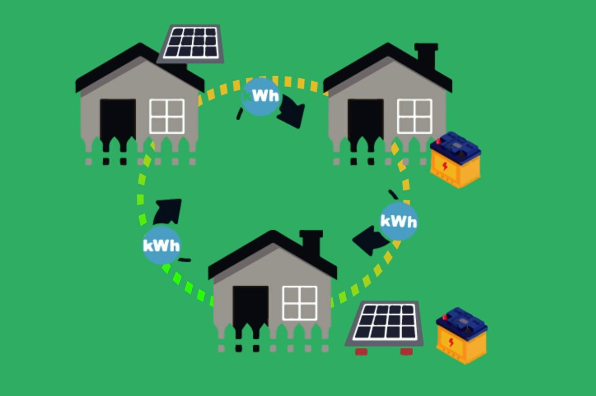

# APIS Hardware Information

## Introduction

APIS hardware information presented here provide information on hardware necessary for executing PP2P energy sharings using [APIS](https://github.com/SonyCSL/APIS), Sony CSL’s energy sharing software that enables autonomous decentralized control. The energy sharings use hardware such as actual battery systems and DC/DC converters.

 

 

These recommended hardware specifications are useful as reference information when designing hardware that carries out not emulations but actual energy sharings between battery systems. Hardware operations thus cannot be guaranteed with these specifications. Users should therefore appropriately design, select, evaluate, and use hardware for the actual energy sharing system.

 

**When designing the hardware for the energy sharing system, in addition to reading the [Document](/MAIN-DOCUMENT_JP.md) below, keep in mind the following:**

* **APIS hardware control policy: The target of control by APIS is only the energy sharing grid.**
  * Control the operation mode, voltage (and droop rate) and current on the DC grid side of the DC/DC converter. 
  * Do not proactively control the battery system’s voltage and current (Read their statuses only)
    * Charging/discharging of the battery system is effectively carried out by controlling the DC/DC converter’s DC grid side.

 

* **APIS hardware protection policy: APIS has no safety protection functions for hardware**
  * APIS carries out energy sharing control within normal system limits in which hardware protection does not operate.
    * Configure various settings (e.g. (hwConfig.json and Policy.json) in apis-main so that APIS operates within normal system limits.
    * In an abnormal situation, it is assumed that the hardware side (including the battery systems, DC/DC converters, and DC grid) will carry out safety protection measures to prevent hardware failures and incidents.

## Documentation
&emsp;[Documentation(EN)](/MAIN-DOCUMENT_EN.md)
 
&emsp;[Documentation(JP)](/MAIN-DOCUMENT_JP.md)
