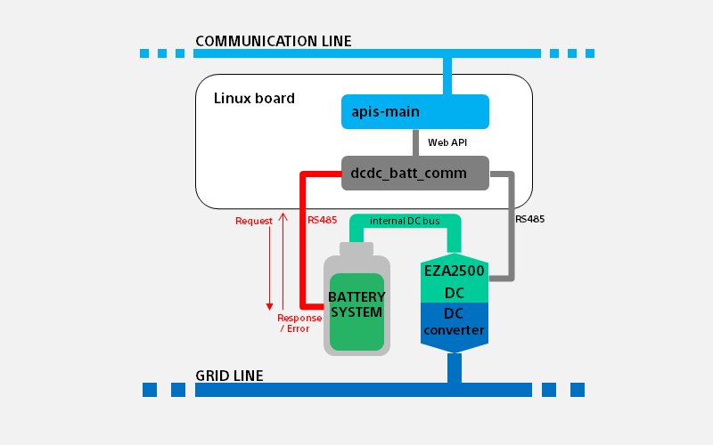

# Battery System Communication Specifications (Implementation Example)

**Table of Contents**
- [Battery System Communication Specifications (Implementation Example)](#battery-system-communication-specifications-implementation-example)
  - [**1. Terms and Abbreviations**](#1-terms-and-abbreviations)
  - [**2. Overview**](#2-overview)
  - [**3. Communication Specifications**](#3-communication-specifications)
  - [**4. Communication Sequence**](#4-communication-sequence)
  - [**5. Register Map**](#5-register-map)
  - [**6. Command Format**](#6-command-format)
    - [6.1 Request Command Format](#61-request-command-format)
    - [6.2 Response Command Format](#62-response-command-format)
    - [6.3 Response Command Format](#63-response-command-format)
    - [6.4 Exeption code](#64-exeption-code)
    - [6.5 CRC Calculation Process](#65-crc-calculation-process)

## **1. Terms and Abbreviations**

| **Term**         | **Description**|
|:--|:--|
| apis-main        | Software for energy sharing developed by Sony CSL that enables autonomous decentralized control.|
| PP2P             | Short for Physical Peer to Peer. Distinguished from conventional P2P in that it is not a technology for facilitating electricity trading using a digital ledger management system like blockchain. Instead, it enables physical energy sharing between specific partners.|
|Unit           |Basic system component that includes a Linux board (apis-main), battery system, and DC/DC converter, forming up a node connected to the DC grid.|
|Cluster           |Multiple apis-mains existing on the communication line form a cluster and carry out energy sharings with units in the same cluster.|


---

## **2. Overview**

The communication specifications presented here describe communication between [APIS](https://github.com/SonyCSL/APIS), the software for energy sharing developed by Sony CSL that enables autonomous decentralized control, and the actual battery system. For communication specification examples, this document uses [dcdc_batt_comm](https://github.com/SonyCSL/apis-dcdc_batt_comm) as the battery system’s device driver.

<div align="center">

</div>

<br>

---

## **3. Communication Specifications**

|Item|Specifications|Remarks|
|:-:|:--|:--|
|Interface|RS485||
|Transmission speed|115200bps|Choose 9600, 19200, 38400, 57600, or 115200 bps|
|Data length|8bit||
|Parity|None||
|Start bit|1bit||
|Stop bit|1bit||
|Flow control|None||
|Communication protocol|Modbus RTU||
|Bit transmission order|LSB|Transmit bits in order from the least significant value.|
|Byte order|Big-endian (BE)|Transmit bytes in order from the most significant value.|
|Error detection|CRC||

<br>

---

## **4. Communication Sequence**
The following shows the communication sequence of request and response. The device driver and the battery system have a master-slave relationship.

|Function code|Transmission direction|Data name|Description|
|:-:|:-:|:-:|:--|
|0x04|Device Driver<br> → battery system|Request|Request to read Input Registers|
|0x04|Battery System<br> → Device Driver|Response|Response with content of specified Input Registers|
|0x84|Battery System<br> → Device Driver|Error|Response when the content of the request is improper or illegal|

<br>

---

## **5. Register Map**
The Modbus addresses of the input registers for battery conditions are as follows.

|Modbus Address|Hex. Addr. Offset*|Data name|Bytes|R/W<br>attribute|Data form|Range|
|:-:|:-:|:-:|:-:|:-:|:-:|:--|
|30030|001D|RSOC<br>(remaining capacity percentage)|2|R|unit16|0.0～100.0%|
|30031|001E|Permit/deny energy sharing|2|R|bit field|Bit 0: Operation status<br>(0: Permit, 1: Deny)<br>Bit 1-15: RESERVED|

*Set at the starting address of the request command

<br>

---

## **6. Command Format**
The basic format of a command is as follows.

|Byte number|-|1|1|N|2|-|
|:-:|:-:|:-:|:-:|:-:|:-:|:--|
|Command Format|Start|Address|Function|Data|CRC Check|End|
|Item|-|Slave Address|Function Code||CRC|-|

<br>

### 6.1 Request Command Format

|Byte|Name of Command Format|Data name|Size|Remarks|
|:-:|:-:|:-:|:-:|:--|
|0|Address|Slave Address|1|Specified on the master side.|
|1|Function|Function Code|1|0x04:Read Input Registers|
|2|Data|Start Address|2|Specifies the value of the starting address’s hexadecimal offset.|
|3|^|^|^|^|^
|4|^|Quantity of Input Registers|2|Number (N) of registers (word=2 bytes)|
|5|^|^|^|^|
|6|CRC Check|CRC|2|Sets the calculation result of 0-5 byte CRC in CRC-Lo, CRC-Hi order.|
|7|^|^|^|^|

<br>

### 6.2 Response Command Format

|Byte|Name of Command Format|Data name|Size|Remarks|
|:-:|:-:|:-:|:-:|:--|
|0|Address|Slave Address|1|Sets Request as-is|
|1|Function|Function Code|1|0x04:Read Input Registers|
|2|Data|Byte Count|1|2xN|
|3|^|Input Register#1|2|Content of requested Register#1|
|4|^|^|^|^|
|5|^|Input Register#2|2|Content of requested Register#2|
|6|^|^|^|^|
|:|^|:|||
|(Nx2)+1|^|Input Register#N|2|Content of requested Register#N|
|(Nx2)+2|^|^|||
|(Nx2)+3|CRC Check|CRC|2|Sets the calculation result of 0-(Nx2)+2 byte CRC in CRC-Lo, CRC-Hi order.|
|(Nx2)+4|^|^|^|^|

||||||||
|:-:|:-:|:-:|:-:|:-:|:-:|:--|
||||||||


<br>

### 6.3 Response Command Format

|Byte|Name of Command Format|Data name|Size|Remarks|
|:-:|:-:|:-:|:-:|:--|
|0|Address|Slave Address|1|Sets request as-is|
|1|Function|Error Code|1|0x80+0x04|
|2|Data|Exception Code|1|01 or 02 or 03 or 04|
|3|CRC Check|CRC|2|Sets the calculation result of 0-2 byte CRC in CRC-Lo, CRC-Hi order.|
|4|^|^|^|^|

<br>

### 6.4 Exeption code
例外コードのについて以下に示す。

|Code|Name|Range|Meaning|
|:-:|:-:|:--|:--|
|01|ILLEGAL FUNCTION|Normal 0x04<br>Abnormal:Other than above|A function code that receives an improper (non-0x04) query is not an action permitted for the server. It is possible that the function code applies only to a new device and is not implemented in the selected unit. The exception could also indicate that the server is in the wrong state to process this type of request. For example, even though not configured, the server is asked to return a register value.|
|02|ILLEGAL DATA ADDRESS|Normal starting address:0000 – 270E<br>Number of registers: 1 – 125<br>Abnormal: Other than above or when the starting address and register numbers exceed range|The data address received by a query whose starting address and number of registers are improper is not an address permitted for the server. Specifically, the combination of the reference number and transfer length is invalid. In the case of a controller with 100 registers, the PDU treats the first register as 0 and the last register as 99. If a request is sent with 96 as the starting address and 4 as the number of registers, this request will be properly processed. If a request is sent with 96 as the starting address and 5 as the number of registers, it will fail with the exception code 0x02 “Illegal Data Address”. This is because when trying to operate on registers 96, 97, 98, 99 and 100, failure occurs as there is no register with address 100.|
|03|ILLEGAL DATA VALUE|Normal: 1 – 125<br>Abnormal: Other than above|A value in query data field outside the range of the number of registers (1 – 125) is not a value permitted for the server. The exception indicates that there is a problem in the structure of the remainder of a complex request, such as incorrect implicit length. Because the MODBUS protocol does not recognize the significance of a particular value of a particular register, this does not mean that the data item presented for storage in the register has a value not expected by the application.|
|04|SERVER DEVICE FAILURE|-|Server failure. Indicates an unrecoverable error has occurred when the server tries to execute the requested action.|


<br>

### 6.5 CRC Calculation Process
The CRC16 calculation process is shown as follows.

**CRC16 calculation logic**
```
unsigned short CRC16 ( puchMsg, usDataLen ) /* The function returns the CRC as a unsigned short type*/
unsigned char *puchMsg ;                    /* message to calculate CRC upon */
unsigned short usDataLen ;                  /* quantity of bytes in message */
{
    unsigned char uchCRCHi = 0xFF ;             /* high byte of CRC initialized */
    unsigned char uchCRCLo = 0xFF ;             /* low byte of CRC initialized */
    unsigned uIndex ;                           /* will index into CRC lookup table */
    while (usDataLen--)                         /* pass through message buffer */
    {
        uIndex = uchCRCLo ^ *puchMsg++ ;            /* calculate the CRC */
        uchCRCLo = uchCRCHi ^ auchCRCHi[uIndex] ;
        uchCRCHi = auchCRCLo[uIndex] ;
    }
    return (uchCRCHi << 8 | uchCRCLo) ;
}
```

**High-order byte table**
```
/* Table of CRC values for high–order byte */
static unsigned char auchCRCHi[] = {
    0x00, 0xC1, 0x81, 0x40, 0x01, 0xC0, 0x80, 0x41, 0x01, 0xC0, 0x80, 0x41, 0x00, 0xC1, 0x81,
    0x40, 0x01, 0xC0, 0x80, 0x41, 0x00, 0xC1, 0x81, 0x40, 0x00, 0xC1, 0x81, 0x40, 0x01, 0xC0,
    0x80, 0x41, 0x01, 0xC0, 0x80, 0x41, 0x00, 0xC1, 0x81, 0x40, 0x00, 0xC1, 0x81, 0x40, 0x01,
    0xC0, 0x80, 0x41, 0x00, 0xC1, 0x81, 0x40, 0x01, 0xC0, 0x80, 0x41, 0x01, 0xC0, 0x80, 0x41,
    0x00, 0xC1, 0x81, 0x40, 0x01, 0xC0, 0x80, 0x41, 0x00, 0xC1, 0x81, 0x40, 0x00, 0xC1, 0x81,
    0x40, 0x01, 0xC0, 0x80, 0x41, 0x00, 0xC1, 0x81, 0x40, 0x01, 0xC0, 0x80, 0x41, 0x01, 0xC0,
    0x80, 0x41, 0x00, 0xC1, 0x81, 0x40, 0x00, 0xC1, 0x81, 0x40, 0x01, 0xC0, 0x80, 0x41, 0x01,
    0xC0, 0x80, 0x41, 0x00, 0xC1, 0x81, 0x40, 0x01, 0xC0, 0x80, 0x41, 0x00, 0xC1, 0x81, 0x40,
    0x00, 0xC1, 0x81, 0x40, 0x01, 0xC0, 0x80, 0x41, 0x01, 0xC0, 0x80, 0x41, 0x00, 0xC1, 0x81,
    0x40, 0x00, 0xC1, 0x81, 0x40, 0x01, 0xC0, 0x80, 0x41, 0x00, 0xC1, 0x81, 0x40, 0x01, 0xC0,
    0x80, 0x41, 0x01, 0xC0, 0x80, 0x41, 0x00, 0xC1, 0x81, 0x40, 0x00, 0xC1, 0x81, 0x40, 0x01,
    0xC0, 0x80, 0x41, 0x01, 0xC0, 0x80, 0x41, 0x00, 0xC1, 0x81, 0x40, 0x01, 0xC0, 0x80, 0x41,
    0x00, 0xC1, 0x81, 0x40, 0x00, 0xC1, 0x81, 0x40, 0x01, 0xC0, 0x80, 0x41, 0x00, 0xC1, 0x81,
    0x40, 0x01, 0xC0, 0x80, 0x41, 0x01, 0xC0, 0x80, 0x41, 0x00, 0xC1, 0x81, 0x40, 0x01, 0xC0,
    0x80, 0x41, 0x00, 0xC1, 0x81, 0x40, 0x00, 0xC1, 0x81, 0x40, 0x01, 0xC0, 0x80, 0x41, 0x01,
    0xC0, 0x80, 0x41, 0x00, 0xC1, 0x81, 0x40, 0x00, 0xC1, 0x81, 0x40, 0x01, 0xC0, 0x80, 0x41,
    0x00, 0xC1, 0x81, 0x40, 0x01, 0xC0, 0x80, 0x41, 0x01, 0xC0, 0x80, 0x41, 0x00, 0xC1, 0x81,
    0x40
} ;
```

**Low-order byte table**
```
/* Table of CRC values for low–order byte */
static char auchCRCLo[] = {
    0x00, 0xC0, 0xC1, 0x01, 0xC3, 0x03, 0x02, 0xC2, 0xC6, 0x06, 0x07, 0xC7, 0x05, 0xC5, 0xC4,
    0x04, 0xCC, 0x0C, 0x0D, 0xCD, 0x0F, 0xCF, 0xCE, 0x0E, 0x0A, 0xCA, 0xCB, 0x0B, 0xC9, 0x09,
    0x08, 0xC8, 0xD8, 0x18, 0x19, 0xD9, 0x1B, 0xDB, 0xDA, 0x1A, 0x1E, 0xDE, 0xDF, 0x1F, 0xDD,
    0x1D, 0x1C, 0xDC, 0x14, 0xD4, 0xD5, 0x15, 0xD7, 0x17, 0x16, 0xD6, 0xD2, 0x12, 0x13, 0xD3,
    0x11, 0xD1, 0xD0, 0x10, 0xF0, 0x30, 0x31, 0xF1, 0x33, 0xF3, 0xF2, 0x32, 0x36, 0xF6, 0xF7,
    0x37, 0xF5, 0x35, 0x34, 0xF4, 0x3C, 0xFC, 0xFD, 0x3D, 0xFF, 0x3F, 0x3E, 0xFE, 0xFA, 0x3A,
    0x3B, 0xFB, 0x39, 0xF9, 0xF8, 0x38, 0x28, 0xE8, 0xE9, 0x29, 0xEB, 0x2B, 0x2A, 0xEA, 0xEE,
    0x2E, 0x2F, 0xEF, 0x2D, 0xED, 0xEC, 0x2C, 0xE4, 0x24, 0x25, 0xE5, 0x27, 0xE7, 0xE6, 0x26,
    0x22, 0xE2, 0xE3, 0x23, 0xE1, 0x21, 0x20, 0xE0, 0xA0, 0x60, 0x61, 0xA1, 0x63, 0xA3, 0xA2,
    0x62, 0x66, 0xA6, 0xA7, 0x67, 0xA5, 0x65, 0x64, 0xA4, 0x6C, 0xAC, 0xAD, 0x6D, 0xAF, 0x6F,
    0x6E, 0xAE, 0xAA, 0x6A, 0x6B, 0xAB, 0x69, 0xA9, 0xA8, 0x68, 0x78, 0xB8, 0xB9, 0x79, 0xBB,
    0x7B, 0x7A, 0xBA, 0xBE, 0x7E, 0x7F, 0xBF, 0x7D, 0xBD, 0xBC, 0x7C, 0xB4, 0x74, 0x75, 0xB5,
    0x77, 0xB7, 0xB6, 0x76, 0x72, 0xB2, 0xB3, 0x73, 0xB1, 0x71, 0x70, 0xB0, 0x50, 0x90, 0x91,
    0x51, 0x93, 0x53, 0x52, 0x92, 0x96, 0x56, 0x57, 0x97, 0x55, 0x95, 0x94, 0x54, 0x9C, 0x5C,
    0x5D, 0x9D, 0x5F, 0x9F, 0x9E, 0x5E, 0x5A, 0x9A, 0x9B, 0x5B, 0x99, 0x59, 0x58, 0x98, 0x88,
    0x48, 0x49, 0x89, 0x4B, 0x8B, 0x8A, 0x4A, 0x4E, 0x8E, 0x8F, 0x4F, 0x8D, 0x4D, 0x4C, 0x8C,
    0x44, 0x84, 0x85, 0x45, 0x87, 0x47, 0x46, 0x86, 0x82, 0x42, 0x43, 0x83, 0x41, 0x81, 0x80,
    0x40
};
```
